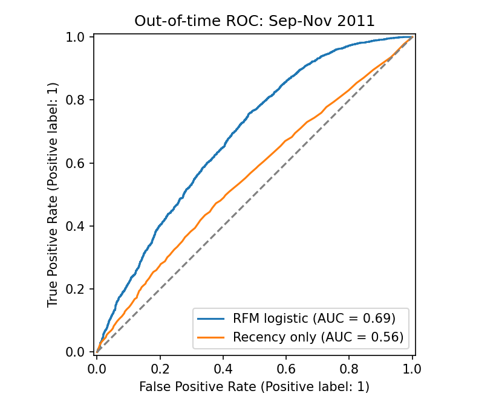
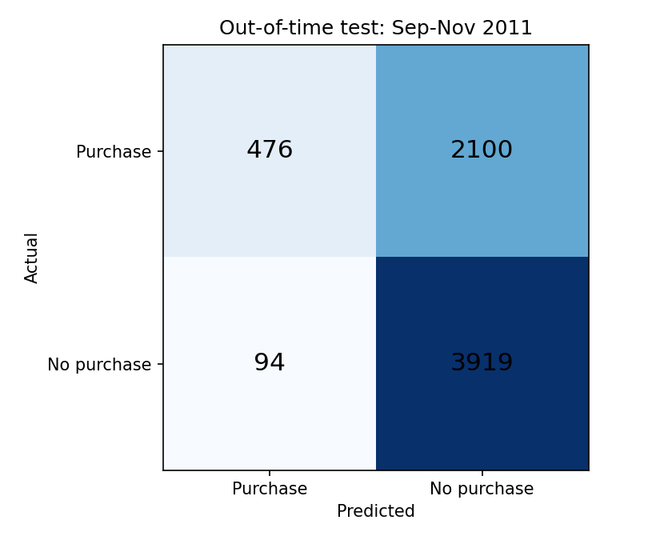
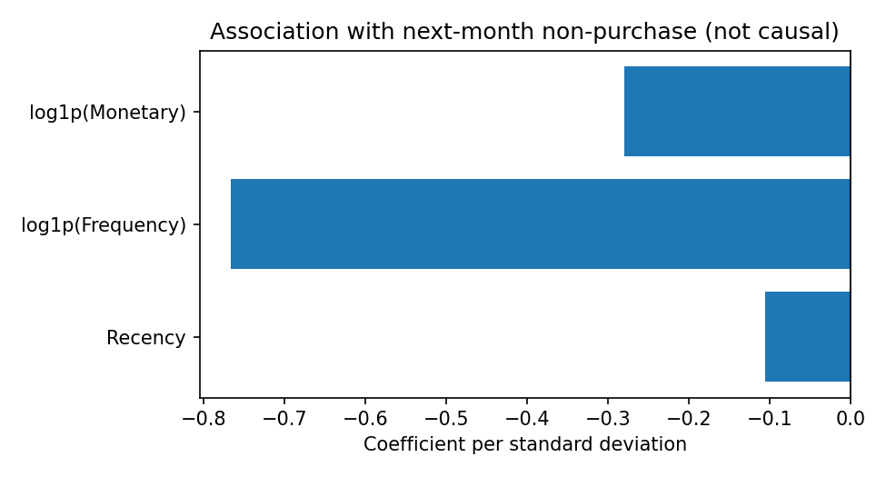

# Customer Repurchase Warning · 电商次月复购预警

用**过去三个月的购买行为，预测客户下一个自然月是否购买**。这是一个可复现的逻辑回归基线项目：从原始交易流水构造“用户 × 月份”样本，按时间训练、验证和测试，并输出按风险排序的客户名单。

> 模型预测的是“次月未购买”，并不等于认定客户永久流失。

[在 Colab 打开 Notebook](https://colab.research.google.com/github/osnddwqd-hub/customer-churn-warning/blob/main/notebook/customer_churn_prediction.ipynb) · [结果文件](output/metrics.json) · [项目方法与面试说明](docs/methodology.md)

## 预测问题

月初，运营团队希望知道：**过去三个月买过东西的客户中，谁在这个月更可能不再购买？**

- 预测对象：观察期内至少有一笔有效购买的客户；观察期内完全没有购买的长期沉默客户不在本模型的目标人群中。
- 观察期：截止时点之前的三个完整自然月。
- 预测期：截止时点开始的下一个完整自然月。
- 标签 `NoPurchaseNextMonth`：预测期没有有效购买为 **1**，有至少一笔有效购买为 **0**。
- 输出 `NoPurchaseProbability`：模型估计的次月未购买概率，适合用于排序；尚未单独做概率校准。

例如，在 **2011-04-01 00:00** 做预测：使用 `[2011-01-01, 2011-04-01)` 的购买记录计算特征；使用 `[2011-04-01, 2011-05-01)` 的真实购买情况生成历史标签。4 月交易绝不会进入这条样本的特征。

| 特征 | 计算口径 |
|---|---|
| Recency | 截止日与观察期内最近购买日期相隔的日历天数；前一天购买为 1 天 |
| Frequency | 观察期内不同 InvoiceNo 的数量；一笔订单多条商品记录只计一次 |
| Monetary | 观察期有效订单商品行的 Quantity × UnitPrice 之和，单位 GBP；为正向消费额，未减去后续退款 |

每一行代表“一个用户在一个月初的状态”，同一用户可产生多个月份的样本。CustomerID、Cutoff 和标签都不会作为输入特征。

## 数据与清洗

使用 [UCI Online Retail](https://archive.ics.uci.edu/dataset/352/online+retail)，记录覆盖 **2010-12-01 至 2011-12-09**，不是实时电商业务数据。来源：Chen, D. (2015), [DOI: 10.24432/C5BW33](https://doi.org/10.24432/C5BW33)，数据许可证 CC BY 4.0。这里发布的衍生 CSV 经过去重、清洗、聚合和预测。

- 原始记录：541,909 行；清洗后：392,692 行，4,338 位客户。
- 删除完全重复的行；保留同一订单的不同商品行。
- 删除关键字段缺失、无效日期、数量≤0、单价≤0、非有限数值以及 InvoiceNo 以 C 开头的取消订单。
- 12 月只有前 9 天，**不能把 12 月剩余时间没有记录当作用户不购买**。监督学习标签只构造至完整的 2011 年 11 月。
- 完整窗口构造出 **17,935 条用户月份样本**，不是 17,935 位独立用户。

## 按时间验证

以下月份是**被预测的月份**，每批特征都分别从前面三个月计算。

| 集合 | 预测月份 | 用户月份样本数 | 用途 |
|---|---|---:|---|
| 训练集 | 2011-03 至 2011-07 | 9,316 | 拟合特征标准化与模型 |
| 验证集 | 2011-08 | 2,030 | 选正则参数 C 与分类阈值 |
| 测试集 | 2011-09 至 2011-11 | 6,589 | 最后报告未来月份效果 |

训练标签最迟在 8 月 1 日已完整可见，验证标签在 9 月 1 日完整可见。同一个客户可在不同集合出现，检验目标是对未来月份的泛化，不是对未见过的新客户的泛化。观察窗口跨集合重叠是正常的，未来交易与未成熟标签不能用于此前训练。

预处理与模型放进同一 Pipeline：`R, log1p(F), log1p(M) → StandardScaler → LogisticRegression`。StandardScaler 只在训练集拟合。对 `C ∈ {0.1, 1, 10}` 按验证集 ROC-AUC 选择，得到 C=0.1；按验证集 F1 选择分类阈值 0.35。评估模型此后保持冻结，测试集不用于拟合、选参数或改阈值。

## 实际测试结果

正类为“次月未购买”，测试集正类占比 **60.90%**。以下是 2011 年 9–11 月合并的结果；所有分类阈值均只使用验证集选择。

| 指标 | RFM 逻辑回归 | 仅 Recency 逻辑回归 | 恒定训练集先验概率 |
|---|---:|---:|---:|
| ROC-AUC | **0.6851** | 0.5553 | 0.5000 |
| Average Precision（PR 汇总指标） | **0.7369** | 0.6577 | 0.6090 |
| Accuracy | 0.6670 | 0.6090 | 0.6090 |
| Precision | 0.6511 | 0.6090 | 0.6090 |
| Recall | 0.9766 | 1.0000 | 1.0000 |
| F1 | 0.7813 | 0.7570 | 0.7570 |
| Brier score（越小越好） | **0.2128** | 0.2403 | 0.2432 |

**这是一个有一定区分能力、但效果有限的基线。** 0.35 阈值倾向于高召回，把约 91% 的样本判为未购买，也产生 2,100 个误报。因此不能单凭高召回说它适合大规模发券；另两个基线在各自验证阈值下把所有样本都预测为正类。




完整的逐月结果、混淆矩阵和运行版本见 [metrics.json](output/metrics.json)。

## 固定预算下的风险排序

另设一个**示例运营预算**：每月只挑选该月风险最高的 20% 客户（人数向上取整），不使用测试结果来决定这个比例。

| 测试月份 | 入选客户数 | 全体次月未购买比例 | 入选客户实际未购买比例 | 相对随机选择的 Lift |
|---|---:|---:|---:|---:|
| 2011-09 | 390 | 62.27% | 81.03% | 1.30 |
| 2011-10 | 433 | 63.81% | 74.13% | 1.16 |
| 2011-11 | 496 | 57.30% | 73.99% | 1.29 |

这里的 Lift 是“识别未购买客户”的提升，**不是发券转化提升或留存收益**。高风险不表示一定能被优惠券挽回，也不表示值得投入最多预算；真实策略还应考虑客户价值、营销成本，并通过 A/B 测试或增量效果模型评估。

## 特征解释



系数来自冻结的评估模型，单位为“经过转换后每一个标准差的变化”。本次运行 Frequency 和 Monetary 系数为负；控制其他特征后，Recency 系数也略为负（约 -0.106）。这与“越久没买，风险一定越高”的简单直觉不同，不能把它强行写成业务规律。系数表示样本中的条件关联，受到特征相关性与人群筛选影响，不是因果解释。

## 运行方式

推荐 Python 3.11 或更新版本。

```bash
git clone https://github.com/osnddwqd-hub/customer-churn-warning.git
cd customer-churn-warning
python -m pip install -r requirements.txt
python -m src.repurchase
python -m unittest discover -s tests -v
```

第一次运行从 UCI 下载 workbook 到 `data/`，后续使用缓存。也可手动下载原始 `Online Retail.xlsx` 后运行：

```bash
python -m src.repurchase --data "/path/to/Online Retail.xlsx"
```

此入口使用该 UCI 数据集的固定覆盖日期和时间划分；换成其他数据集时必须先修改覆盖日期、窗口和划分，不能直接套用。`requirements-lock.txt` 记录已发布结果的直接依赖版本；完整运行版本与原始文件 SHA256 在 metrics.json 中。Notebook 与命令行调用同一实现，避免两套代码产生不同逻辑。

## 输出与真正推断

| 文件 | 内容 |
|---|---|
| `output/metrics.json` | 时间划分、测试指标、来源哈希和运行版本 |
| `output/monthly_top20_metrics.csv` | 各测试月份的固定预算排序结果 |
| `output/coefficients.csv` | 冻结评估模型的标准化系数 |
| `output/validation_selection.csv` | 验证集选参记录 |
| `output/high_risk_users.csv` | 2011 年 12 月预测：截至 12 月 1 日特征，风险最高 20%，共 571 人；没有真实标签 |
| `output/december_forecast.csv` | 本地生成的完整 12 月预测，共 2,851 人 |
| `output/test_predictions.csv` | 本地生成的 9–11 月测试预测与真实标签 |
| `output/user_month_samples.csv` | 本地生成的全部历史样本 |
| `output/repurchase_model.joblib` | 已训练的部署模型及其元信息；运行项目时也会重新生成，依赖版本见 requirements-lock.txt |

12 月推断使用**单独的部署模型**：沿用验证集选定的 C，在 12 月 1 日已完整可见的 3–11 月标签上重训，再使用 9–11 月特征预测 12 月。冻结测试模型的指标仍单独报告，不能把重训后模型当成已经通过测试的同一个模型。

12 月名单没有真实标签；由于原始数据只到 12 月 9 日，**不报告 12 月预测准确率**。未来实际部署需要新交易数据，此处只是用历史数据模拟一次当时可执行的预测。

## 检查与后续工作

已有 6 项回归检查：时间边界、RFM 订单口径、未来数据修改不影响过去特征、不完整标签窗口拒绝、训练标签成熟时间、标准化只使用训练数据。另完整执行 Notebook 与原始数据流程。

后续可增加多月份滚动验证、购买频率变化和更长周期特征，比较树模型，检查概率校准，并对运营干预做实验。当前样本只有约一年、包含重复用户且业务季节性明显，不声称模型在其他年份、行业或新客户上具有同样效果。
